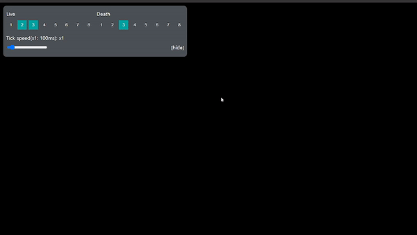

# Custom-lifegame

Life game where you can change the live, death, and tickSpeed values

## Usage

open dev server

```bash
npm run dev
(and open localhost:8080)
```

build

```bash
npm run build
```

### Control

| Enter      | Mouse wheel move |
| ---------- | ---------------- |
| start tick | zoom in-out      |


